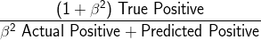
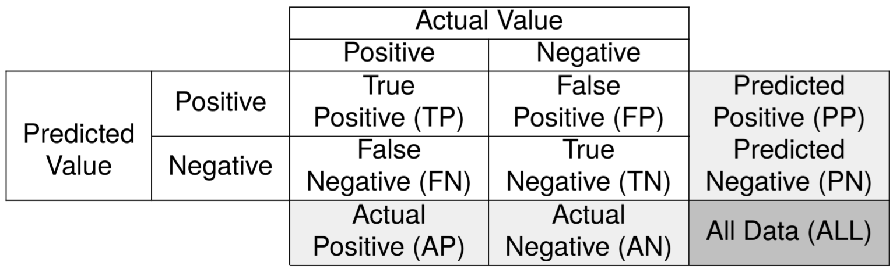
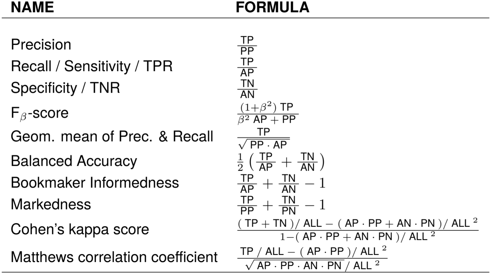
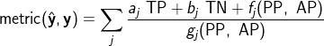

# ap_perf

This package provides a way to easily optimize generic performance metrics in supervised learning settings using the [Adversarial Prediction](https://arxiv.org/abs/1812.07526) framework. 
The method can be integrated easily into differentiable learning pipelines.
The package is a Python implementation of an AISTATS 2020 paper, ["AP-Perf: Incorporating Generic Performance Metrics in Differentiable Learning"](https://arxiv.org/abs/1912.00965), by [Rizal Fathony](http://rizal.fathony.com) and [Zico Kolter](http://zicokolter.com). 
For the original Julia implementation, please check  [AdversarialPrediction.jl](https://github.com/rizalzaf/AdversarialPrediction.jl).


## Overview

`ap_perf` enables easy integration of generic performance metrics (including non-decomposable metrics) into our differentiable learning pipeline. It currently supports performance metrics that are defined over binary classification problems.
Below is a code example for incorporating the F-2 score metric into a convolutional neural network training pipeline of [PyTorch](https://pytorch.org/). 

```python
import torch
import torch.nn as nn
from ap_perf import PerformanceMetric, MetricLayer

class Net(nn.Module):
    def __init__(self):
        super().__init__()
        self.fc1 = nn.Linear(30, 100)
        self.fc2 = nn.Linear(100, 100)
        self.fc3 = nn.Linear(100, 1)
        
    def forward(self, x):
        x = F.relu(self.fc1(x))
        x = F.relu(self.fc2(x))
        x = self.fc3(x)
        return x.squeeze() 

# metric definition
class Fbeta(PerformanceMetric):
    def __init__(self, beta):
        self.beta = beta

    def define(self, C):
        return ((1 + self.beta ** 2) * C.tp) / ((self.beta ** 2) * C.ap + C.pp)  

# initialize metric
f2_score = Fbeta(2)
f2_score.initialize()
f2_score.enforce_special_case_positive()

# create a model and criterion layer
model = Net().to(device)
criterion = MetricLayer(f2_score).to(device)

# forward pass
optimizer.zero_grad()
output = model(inputs)
objective = criterion(output, labels)

# backward pass
objective.backward()
optimizer.step()
```

As we can see from the code above, we can just write a `Fbeta` class that inherits `PerformanceMetric` class that contains the formula the F-beta score calculated from the entities in the confusion matrix. The `PerformanceMetric` class provides all the computations of the adversarial prediction formulation for a given metric. We then incorporate it into our learning pipeline using `MetricLayer` class (which inherits PyTorch's `nn.Module`). The `MetricLayer` serves as the objective of the optimization, replacing the standard `nn.BCEWithLogitsLoss` class. 

```python
# Standard training with binary cross-entropy loss.
model = Net().to(device)
criterion = nn.BCEWithLogitsLoss().to(device)

# forward pass
optimizer.zero_grad()
output = model(inputs)
objective = criterion(output, labels)

# backward pass
objective.backward()
optimizer.step()
```

Note that the equation for F-beta in general is:   
<div style="text-align:center"></div>


## Installation

`ap_perf` can be installed using `pip`:
```
pip install ap_perf
```
Some pre-requisite packages will be installed automatically: `numpy`, `scipy`, and `numba`. 
It also requires `PyTorch` version `1.x`.


## Performance Metrics

Different tasks in machine learning  require different metrics that align  well with the tasks. For binary classification problems, many of the commonly used performance metrics are derived from the confusion matrix. 
A confusion matrix is a table that reports the values that relate the prediction of a classifier with the ground truth labels. The table below shows the anatomy of a confusion matrix.

<div style="text-align:center"></div>

Some of the metrics are decomposable, which means that it can be broken down to an independent sum of another metric that depends only on a single sample. However, most of the interesting performance metrics are non-decomposable, where we need to consider all samples at once. There are a wide variety of non-decomposable performance metrics, for example:

<div style="text-align:center"></div>

`ap_perf` supports a family of performance metrics that can be expressed as a sum of fractions:

<div style="text-align:center"></div>
 
where a<sub>j</sub> and b<sub>j</sub> are constants, whereas f<sub>j</sub> and g<sub>j</sub> are functions over PP and AP.
Hence, the numerator is a linear function over true positive (TP) and true negative (TN) which may also depends on sum statistics, i.e., predicted and actual positive (PP and AP) as well as their negative counterparts (predicted and actual negative (PN and AN)) and all data (ALL). Note that PN, AN, and ALL can be derived form PP and AP since ALL is just a constant, PN = ALL - PP, and AN = ALL - AP. 
The denominator depends only on the sum statistics (PP, AP, PN, AN, and ALL). This construction of performance metrics covers a vast range of commonly used metrics, including all metrics in the table above.


## Defining Performance Metrics

A performance metric can be defined in `ap_perf` by inheriting the `PerformanceMetric` class.  Inside the class, we also need to write the definition of the metric by implementing a method that depends on the type of the metric and the confusion matrix: `def define(self, C)`. Here, `C` contains all entities in the confusion matrix. Below is an example of the F-1 score metric definition.
```python
class F1score(PerformanceMetric):
    def define(self, C):
        return (2 * C.tp) / (C.ap + C.pp)  
```

Some performance metrics (e.g., precision, recall, F-score, sensitivity, and specificity) enforce special cases to avoid division by zero. For the metrics that contain true positive, the special case is usually defined when the prediction or the true label for every sample are all zero. In this case, the metric is usually defined as 1 if both the prediction and the true label are all zero; otherwise, the metric is 0. For the metrics that contain true negative, similar cases occur, but with the prediction or the true label for every sample are all one.
Therefore, when instantiating a metric, we need to take into account these special cases, for example, in the case of F-1 score:
```python
f1_score = F1score()
f1_score.initialize()
f1_score.enforce_special_case_positive()
```

For some performance metrics, we may want to define a parametric metric. For example, the F-beta score, which depends on the value of beta. In this case, we can store the parameter as a field in our metric class, which then be used in the computation of the metric inside the `define` method. For the case of the F-beta score metric, the code is:
```python
class Fbeta(PerformanceMetric):
    def __init__(self, beta):
        self.beta = beta

    def define(self, C):
        return ((1 + self.beta ** 2) * C.tp) / ((self.beta ** 2) * C.ap + C.pp)  

f1_score = Fbeta(1)
f1_score.initialize()
f1_score.enforce_special_case_positive()

f2_score = Fbeta(2)
f2_score.initialize()
f2_score.enforce_special_case_positive()
```


We can define arbitrary complex performance metrics inside the `define` method, so long as it follows the construction of metrics that the package support. We can also use intermediate variables to store partial expression of the metric. Below is a code example for Cohen's kappa score.
```python
class Kappa(PerformanceMetric):
    def define(self, C):
        dmin = (C.ap * C.pp + C.an * C.pn) / C.all**2
        num = ((C.tp + C.tn) / C.all) - dmin
        den = 1 - dmin
        return num / den

kappa = Kappa()
kappa.initialize()
kappa.enforce_special_case_positive()
kappa.enforce_special_case_negative()
```

## Performance Metric with Constraints 

In some machine learning settings, we may want to optimize a performance metric subject to constraints on other metrics. This occurs in the case where there are trade-offs between different performance metrics. For example, a machine learning system may want to optimize the precision of the prediction; subject to its recall is greater than some threshold. We can define the constraints in the metric by implementing the method: `def constraint(self, C)`. The code format for the constraints is `metric >= th`, where `th` is a real-valued threshold. Below is an example:
```python
# Precision given recall metric
class PrecisionGvRecall(PerformanceMetric):
    def __init__(self, th):
        self.th = th

    def define(self, C):
        return C.tp / C.pp   

    def constraint(self, C):
        return C.tp / C.ap >= self.th   

precision_gv_recall_80 = PrecisionGvRecall(0.8)
precision_gv_recall_80.initialize()
precision_gv_recall_80.enforce_special_case_positive()
precision_gv_recall_80.set_cs_special_case_positive(True)

precision_gv_recall_60 = PrecisionGvRecall(0.6)
precision_gv_recall_60.initialize()
precision_gv_recall_60.enforce_special_case_positive()
precision_gv_recall_60.set_cs_special_case_positive(True)
```

Note that the method `enforce_special_case_positive` enforces special cases for the precision metric, whereas `set_cs_special_case_positive` enforces special cases for the metric in the constraint (recall metric).

We can also have two or more metrics in the constraints, for example:
```python
# Precision given recall >= th1 and specificity >= th2
class PrecisionGvRecallSpecificity(PerformanceMetric):
    def __init__(self, th1, th2):
        self.th1 = th1
        self.th2 = th2

    def define(self, C):
        return C.tp / C.pp   

    def constraint(self, C):
        return [C.tp / C.ap >= self.th1, 
                C.tn / C.an >= self.th2]   

precision_gv_recall_spec = PrecisionGvRecallSpecificity(0.8, 0.8)
precision_gv_recall_spec.initialize()
precision_gv_recall_spec.enforce_special_case_positive()
precision_gv_recall_spec.set_cs_special_case_positive([True, False])
precision_gv_recall_spec.set_cs_special_case_negative([False, True])
```

Here, we need to provide an array of boolean for the `set_cs_special_case_positive` and `set_cs_special_case_negative` methods.

## Computing the Values of the Metric

Given we have a prediction for each sample `yhat` and the true label `y`, we can call the method `compute_metric` to compute the value of the metric. Both `yhat` and `y` are vectors containing 0 or 1. 
```python
>>> f1_score.compute_metric(yhat, y)
0.8
```  

For a metric with constraints, we can call the method `compute_constraints` to compute the value of every  metric in the constraints. For example:
```python
>>> precision_gv_recall_spec.compute_constraints(yhat, y)
array([0.6, 0.6])
```  

## Incorporating the Metric into Differentiable Learning Pipeline

As we can see from the first code example, we can use the `MetricLayer` class to incorporate the metrics we define into PyTorch differentiable learning pipeline. This class inherits the standard PyTorch `nn.Module`.
The class provides forward and backward computation, which returns the objective and gradient information from the adversarial prediction formulation. The gradient is then be propagated to the previous layers.
The `MetricLayer` serves as the objective of the optimization, replacing the standard `nn.BCEWithLogitsLoss` class.
```python
output = model(inputs)
criterion = nn.BCEWithLogitsLoss().to(device)
objective = criterion(output, labels)
objective.backward()
```
We can easily replace the existing codes that use binary cross-entropy by simply change the criterion to `MetricLayer`, i.e.:
```python
output = model(inputs)
criterion = MetricLayer(f2_score).to(device)
objective = criterion(output, labels)
objective.backward()
```

## Customizing Inner Optimization Solver

For solving the inner optimization problem, `ap_perf` uses an ADMM based formulation. In the default setting, it will run 100 iterations of the ADMM optimization. We can also manually set the number of iteration using `max_iter` argument by storing it inside a dictionary and pass it to the `MetricLayer` class.

```python
solver_params = {'max_iter' : 50}
criterion = MetricLayer(f2_score, solver_params).to(device)
```


## Running Time and Batch Size 

The adversarial prediction formulation insidethe criterion objective needs to solve a maximin problem with a quadratic size of variables using the ADMM solver. The complexity of solving the problem is O(m^3), where m is the number of samples in a minibatch.
In practice, for a batch size of 25, the ADMM solver takes around 50 - 60 milliseconds to solve on a PC with an Intel Core i7 processor. If we reduce the ADMM iterations to 50 iterations, it will take around 25 - 30 milliseconds.

> Note: The Julia implementation of AP-Perf is roughly twice as fast as this Python implementation. please check  [AdversarialPrediction.jl](https://github.com/rizalzaf/AdversarialPrediction.jl) for the Julia implementation.

## Commonly Used Metrics

The package provides definitions of commonly use metrics including: `f1_score`, `f2_score`, `gpr`, `mcc`, `kappa`, etc. To load the metrics to the current Julia environment, please use `ap_perf.common_metrics`. Please check the detailed definition of the metrics in `ap_perf/common_metrics.py`.

```python
from ap_perf import PerformanceMetric, MetricLayer
from ap_perf.common_metrics import f1_score, kappa

criterion = MetricLayer(kappa).to(device)
```


## Code Examples

This repository contains a usage example in tabular dataset. `tabular.py` contains an example on classication with tabular data. 
Please also visit [AP-examples](https://github.com/rizalzaf/AP-examples) repository for more examples on the experiment presented in the paper (coded in Julia).


## Citation

Please cite the following paper if you use `ap_perf` for your research.
```
@article{ap-perf,
  title={AP-Perf: Incorporating Generic Performance Metrics in Differentiable Learning},
  author={Fathony, Rizal and Kolter, Zico},
  journal={arXiv preprint arXiv:1912.00965},
  year={2019}
}
```


## Acknowledgements

This project is supported by a grant from the [Bosch Center for Artificial Intelligence](https://www.bosch-ai.com/).

This project is not possible without previous foundational research in Adversarial Prediction by [Prof. Brian Ziebart's](https://www.cs.uic.edu/Ziebart) and [Prof. Xinhua Zhang's](https://www.cs.uic.edu/~zhangx/) research groups at the [University of Illinois at Chicago](https://www.cs.uic.edu).
